# docker-practice
Day1
----
* Docker installation steps
    * To install docker firstly we have to create a linux machine.
    * Required commands for installation of docker
    * `sudo apt update`
    * `curl -fsSL https://get.docker.com -o get-docker.sh` && `sh get-docker.sh`
    * Add user into docker group by using below command
    * `sudo usermod -aG docker ubuntu`
    * Exit from the linux machine
    * Reconnect it 
    * type the command `docker info`
    * DOCKER WORKBOOK – 1
 * RUNNING DOCKER CONTAINERS  
* Run hello-world docker container and observe the container status?
  * `docker container run -d -P --name myworld hello-world:latest`
  * `docker container run -it -P --name myworld hello-world:latest`
  * To see the container is running or not `docker container ls`
  * 
  * 
  * 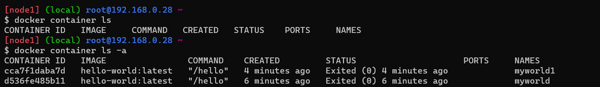
* Check the docker images and also write down the size of hello-world image?
  * 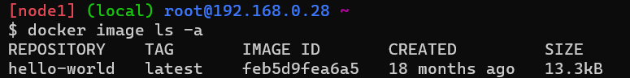
* Run the nginx container with name as nginx1 and expose it on 8080 port on docker host?
  * 
  * 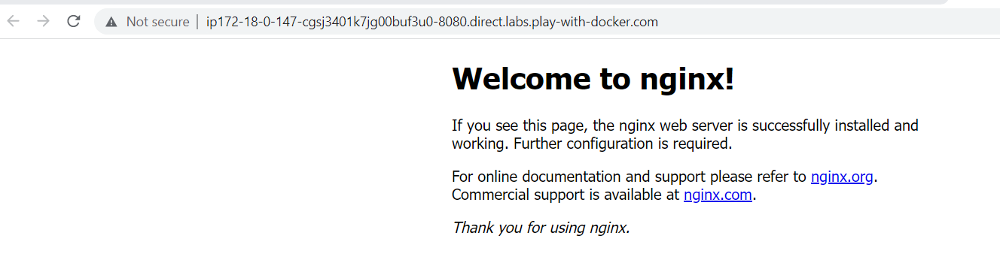
* Explain docker container lifecycle?
  * The complete lifecycle of a docker container revolves around 
  * Phases: Create phase, Running phase, Paused phase/unpause phase, start phase, stop phase, remove phase of container.
  * 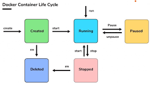
* Explain what happens when you run the docker container?
  * The docker run command creates running containers from images and can run commands inside them.When using the docker run command, a container can run a default action (if it has one), a user specified action, or a shell to be used interactively.
* Show all the states of docker container on nginx based container?
  * 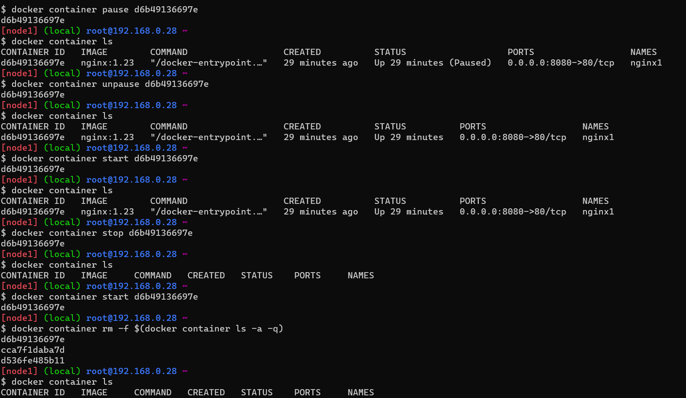
* Explain docker architecture?
  * Docker architecture. Docker uses a client-server architecture. The Docker client talks to the Docker daemon, which does the heavy lifting of building, running, and distributing your Docker containers. The Docker client and daemon can run on the same system, or you can connect a Docker client to a remote Docker daemon.
  * 

Day2
---
* Nodejs-Express application
  * commands to build and create.
  * To build image:"docker image build -t node1:16-alpine ." <name:version>
  * To Create container :"docker container run --name newjs -d -P 1a0288859300 =>"<image name/id>

 * trail-1
```Dockerfile
  FROM node:16-alpine
  LABEL author="Manu" organization="khaja.tec" project="nodejs"
  RUN apk add --update npm && \
    apk add git && \
    git clone https://github.com/expressjs/express.git && \
    cd express && \
    npm install express && \
    npm install -g express-generator@4 && \
    express /tmp/foo && \
    cd /tmp/foo && \
    npm install
 WORKDIR /tmp/foo
 EXPOSE 3000
 CMD ["npm", "start"]
```

output :


trail-2
```Dockerfile
FROM node:16-alpine
LABEL author="Manu" organization="khaja.tec" project="nodejs"
RUN apk add --update  && \
    apk add git && \
    git clone https://github.com/expressjs/express.git \
    && cd express && \
    npm install express && \
    npm install -g express-generator@4 && \
    express /tmp/foo && cd /tmp/foo && \
    npm install
WORKDIR /tmp/foo
EXPOSE 3000
CMD ["npm", "start"]

```

Day-3
-----
Create an alpine container in interactive mode and instal python 
------------------------------------------------------------------
  * Ans: `docker container run -it --name alpine1 -P alpine:3.16` 
  *  `apk add --update`
  *  `apk add python3` 
  *  `python3 --version`
  * 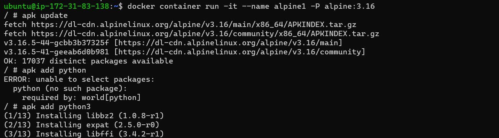
    
Create an ubuntu container with sleep 1d then login user exec.Install python
----------------------------------------------------------------------------
  * Ans:`docker container run -d --name py -P ubuntu:20.04 sleep 1d`,
  * `docker container exec -it py /bin/bash`,
  * `apt update`,`apt install python3` 
  * `python3 --version`
  * 
  * 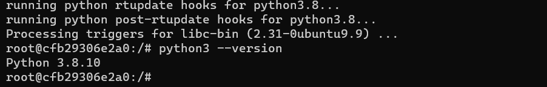

Create a postgress container with user panoramic and password as trekking. try logging in and show the databases (querry for thr psql)
--------------------------------------------------------------------------------------------------------------------------------------
  * Ans:`docker container run -d --name database -e POSTGRES_USER=panoramic -e POSTGRES_PASSWORD=trekking -e POSTGRES_DB=psqldata -P postgres:15`,`docker exec -it database /bin/bash`,`psql --help`,this command is used to list the database `\l`
 
  * 
  * 
  *  * To create table `CREATE TABLE Persons (
    PersonID int,
    LastName varchar(255),
    FirstName varchar(255),
    Address varchar(255),
    City varchar(255)
);`
`Insert into Persons Values (1, 'manohar', 'gatla', 'srnagar', 'hyd'); Insert into Persons Values (2, 'raju', 'gatla', 'srnagar', 'hyd'); Insert into Persons Values (3, 'pavan', 'gatla', 'srnagar','hyd'); Insert into Persons Values (4, 'Rajreddy', 'gatla', 'srnagar', 'hyd');
SELECT * from Person;`"`
  * 
  
Try creating a docker file which runs phpinfo page, user ARG and ENV wherever appropriate 
 ----------------------------------------------------------------------------------------
  * on apache server
``` Dockerfile
FROM ubuntu:22.04
LABEL author="manu"
ARG DEBIAN_FRONTEND=noninteractive
RUN apt update && apt install apache2 -y
RUN apt install php libapache2-mod-php -y
RUN echo "<?php phpinfo() ?>" >> /var/www/html/info.php
EXPOSE 80
CMD ["apache2ctl","-D","FOREGROUND"] 
```
  * ` docker image build -t apache .`
  * ` docker container run --name php -d -P apache`
  * 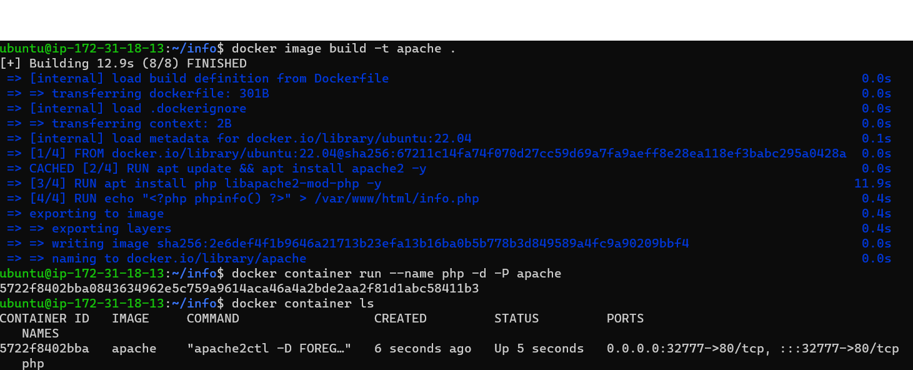
  * 
  
  * on nginx server
``` Dockerfile
  FROM ubuntu:22.04
LABEL author="manu"
ARG DEBIAN_FRONTEND=noninteractive
RUN apt update && apt upgrade -y
RUN apt install nginx -y
RUN apt install php8.1 php8.1-fpm -y && \
    rm -rf /var/lib/apt/lists/

COPY nginx.conf /etc/nginx/sites-available/default
RUN nginx -t
RUN chmod -R 777 /var/www/html
RUN echo "<?php phpinfo() ?>" >> /var/www/html/info.php
RUN service php8.1-fpm restart
EXPOSE 80
ENTRYPOINT ["/bin/bash","-c","service php8.1-fpm start && nginx -g 'daemon off;'"]
CMD ["nginx","-g","daemon off;"]
```
  * ` docker image build -t nginx .`
  * 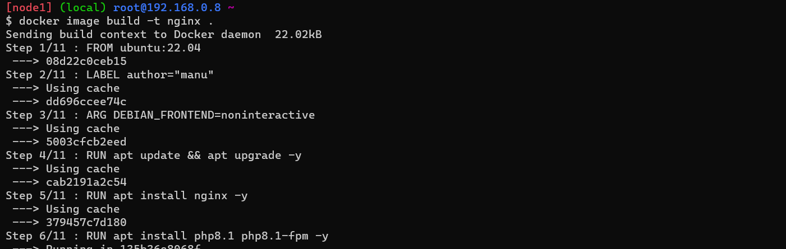
  * ` docker container run --name php -d -P nginx`
  * 
  * 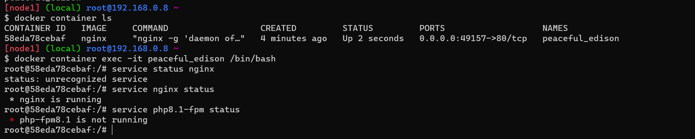
  * 

create a jenkins image by creating your own Dockerfile
------------------------------------------------------
```Dockerfile
FROM ubuntu:22.04
LABEL author="manu"
RUN apt update && apt install openjdk-11-jdk maven curl -y
RUN curl -fsSL https://pkg.jenkins.io/debian-stable/jenkins.io-2023.key | tee \
   /usr/share/keyrings/jenkins-keyring.asc > /dev/null
RUN echo deb [signed-by=/usr/share/keyrings/jenkins-keyring.asc] \
  https://pkg.jenkins.io/debian-stable binary/ | tee \
  /etc/apt/sources.list.d/jenkins.list > /dev/null
RUN apt-get update 
RUN apt-get install jenkins -y
EXPOSE 8080
CMD ["/usr/bin/jenkins"]
```
`docker build image -t jenkins .`
* 
`docker container run -- name manu -d -P jenkins`
* 
* 
* 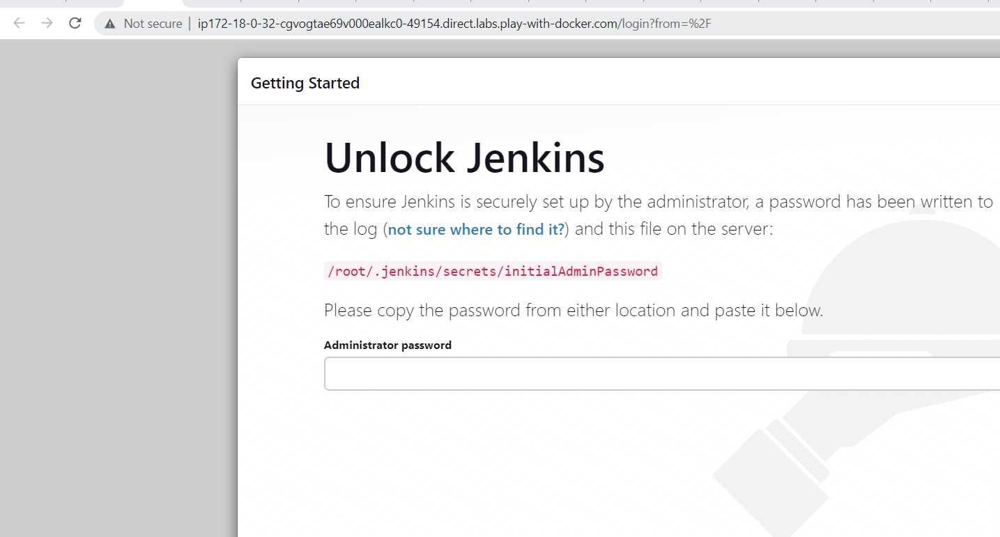

Create nop commerce and my-sql server  containers and try to make them work by configuring.
-------------------------------------------------------------------------------------------
* `dockerimage build -t nop:latest`
* 
* `docker container run -d --name mysql -e MYSQL_ROOT_PASSWORD=manoharg -e MYSQL_DATABASE=test -e MYSQL_USER=manu -e MYSQL_PASSWORD=gatla --network nopnetwork -v mysql:/var/lib/mysql mysql:5.6`
* 
* 
* `docker container run --name nopapp -d -e MYSQL_SERVER=mysql --network nopnetwork -P nop:latest`
* 
* 


Docker Workshop-3 Activities (21/APR/2023) - Khaja Sir   
------------------------------------------------------------------------

A) Create a multi-stage docker file to build  
---------------------------------------------
 a) nop commerce
 ---------------
  * Created multi stage dockerfile 
```Dockerfile
  ## stage-1
  FROM ubuntu:22.04 as nopCommerce
  RUN apt update && apt install unzip -y
  ARG DOWNLOAD_URL=https://github.com/nopSolutions/nopCommerce/releases/download/release-4.60.2/nopCommerce_4.60.2_NoSource_linux_x64.zip
  ADD ${DOWNLOAD_URL} /nopCommerce/nopCommerce_4.60.2_NoSource_linux_x64.zip
  RUN cd /nopCommerce && unzip nopCommerce_4.60.2_NoSource_linux_x64.zip && \
  mkdir bin logs && rm nopCommerce_4.60.2_NoSource_linux_x64.zip
  ## stage-2
  FROM mcr.microsoft.com/dotnet/sdk:7.0
  LABEL author="manu" organization="khaja.tech" project="nop"
  ARG DIRECTORY=/nop
  WORKDIR ${DIRECTORY}
  COPY --from=nopCommerce  /nopCommerce ${DIRECTORY}
  EXPOSE 5000
  ENV ASNETCORE_URLS="http://0.0.0.0:5000"
  CMD ["dotnet","Nop.Web.dll","--urls","http://0.0.0.0:5000"] 
  ```
  * `docker image build -t nop:1.0 .`
  * `docker container run -d -P nop:1.0`
  * 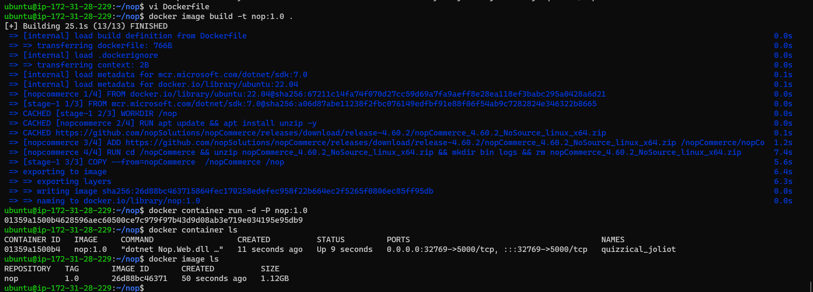
  *  
  
 b) spring petclinic
 -------------------
  *  Created multi stage dockerfile
 ```Dockerfile
  ## stage -1
  FROM amazoncorretto:17-alpine-jdk as spc
  LABEL author="manu" project="springpetclinic" organization="khaja.tech"
  RUN wget https://referenceapplicationskhaja.s3.us-west-2.amazonaws.com/spring-petclinic-2.4.2.jar
  EXPOSE 8080
  CMD ["java", "-jar", "/spring-petclinic-2.4.2.jar"]
  ## stage -2
  FROM amazoncorretto:11
  LABEL author="manu" project="springpetclinic" organization="khaja.tech"
  COPY --from=spc /spring-petclinic-2.4.2.jar /spring-petclinic-2.4.2.jar
  EXPOSE 8080
  CMD ["java", "-jar", "/spring-petclinic-2.4.2.jar"] 
  ```

 * `docker image build -t spc:latest .`
 * `docker container run -d -P spc:latest`
 * 
 * 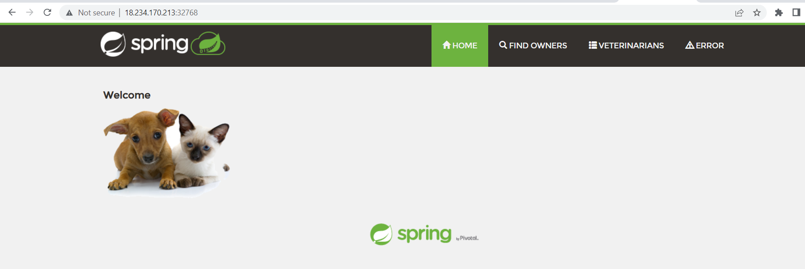 
  
c) student courses register
 ---------------------------
   ```Dockerfile
## multi stage docker file
## stage 1
FROM alpine:3.17 as source
LABEL author="Manohar" project="StudentCoursesRestAPI"
RUN apk add --update && apk add git
RUN git clone https://github.com/manohargatla/StudentCoursesRestAPI.git /StudentCoursesRestAPI
## stage 2
FROM python:3.7-alpine
LABEL author="Manohar" project="StudentCoursesRestAPI"
COPY --from=source /StudentCoursesRestAPI /StudentCoursesRestAPI
WORKDIR /StudentCoursesRestAPI 
RUN pip install --upgrade pip 
RUN pip install -r requirements.txt
EXPOSE 8080
ENTRYPOINT ["python","app.py"]
```
 * `docker image build -t scr:1.0`
 * 
 * `docker container run -d -P scr:1.0`
 * 
 * 
 * 
B) push images to AWS ECR
-------------------------  
  a) AWS ECR
  -----------
* create ECR repo in Aws
* Install aws cli and Configure
* Run the commands by using view push commands in ECR
* `docker image build -t spc .`
* `docker tag spc:latest 336607023349.dkr.ecr.us-east-1.amazonaws.com/spc:latest`
* `docker push 336607023349.dkr.ecr.us-east-1.amazonaws.com/spc:latest`
* 
* 
* 
* 
* 
* 


C) Write a docker compose file for
------------------------------------
  a) Nop Commerce
  ---------------
  ```yaml
  version: '3.9'
services:
  nop-db:
    image: mysql:5.7
    restart: always
    container_name: my-sql
    environment:
      MYSQL_DATABASE: 'db'
      # You can use whatever password you like
      MYSQL_PASSWORD: 'manumanu'
      # Password for root access
      MYSQL_ROOT_PASSWORD: 'manohar'
      # Password for root access
      MYSQL_USER: 'nop'
    expose:
      - '3306'
    ports: 
      - 35000:3306
    networks:
      - nop-net
    volumes:
      - my-db:/var/lib/mysql
  nop:
    container_name: nopapp
    build:
      context: .
      dockerfile: Dockerfile
    ports:
      - 30001:5000
    environment:
      MYSQL_SERVER: my-sql
    networks:
      - nop-net
# Names our volume
volumes:
  my-db:
# Names our network
networks:
  nop-net: 
  ```
* To configure the docker-compose file it requrires dockerfile also in same directory.
* To run docker-compose file we have to use command as `docker compose up`
* 
* 
* 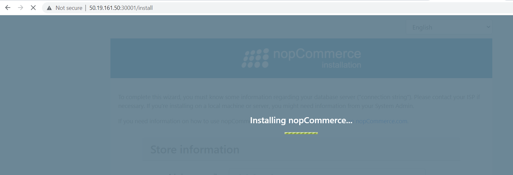

b) Spring petclinic
-------------------
```yaml
version: '3.9'
services:
  spc-app:
    build:
      context: .
      dockerfile: Dockerfile
    ports: 
        - "8000:8080" 
```
* To configure the docker-compose file it requrires dockerfile also in same directory.
* To run docker-compose file we have to use command as `docker compose up`
* 
* 
* 

c) Game of life
---------------
```Dockerfile
## stage-1
FROM tomcat:9-jdk8 as gol
LABEL author="manu" organization="qt"
ARG GOL_URL=https://referenceapplicationskhaja.s3.us-west-2.amazonaws.com/gameoflife.war
ADD ${GOL_URL} /usr/local/tomcat/webapps/gameoflife.war
RUN apt update && apt install unzip -y
RUN unzip /usr/local/tomcat/webapps/gameoflife.war
VOLUME "/usr/local/tomcat"
## stage-2
FROM tomcat:9.0
LABEL author="manu" organization="khaja.tech"
COPY --from=gol /usr/local/tomcat/webapps/ /usr/local/tomcat/webapps/
EXPOSE 8080
CMD ["catalina.sh","run"]
```
* `docker image build -t gol:1.1 .`
* 
* `docker container run -d -P gol:1.1`
* 
* 
d) Student Courses Register
---------------------------
* docker-compose file
```yaml
version: '3.9'
services:
  scr:
    build:
      context: .
      dockerfile: Dockerfile
    ports: 
        - "3000:8080" 
```
* docker compose up
* 
* 
* 

Create Multi-stage build Docker image any opensource code like spring-petclinic, ecomance application
RUN Application with User in one DockerImage & Application as root user
-----------------------------------------------------------------------
 ```Dockerfile
## multi stage docker file for studentcourse
## stage 1
FROM alpine:3.17 as source
LABEL author="Manohar" project="StudentCoursesRestAPI"
RUN apk add --update && apk add git
RUN git clone https://github.com/manohargatla/StudentCoursesRestAPI.git /StudentCoursesRestAPI
## stage 2
FROM python:3.7-alpine
LABEL author="Manohar" project="StudentCoursesRestAPI"
ARG user=manu
ARG group=gatla
ARG gid=10000
ARG uid=10001
ARG HOME_DIR=/StudentCoursesRestAPI
RUN addgroup -g ${gid} ${group} \
&& adduser -h "$HOME_DIR" -u ${uid} -g ${gid} -D -s /bin/bash ${user}
USER ${user}
COPY --from=source /StudentCoursesRestAPI ${HOME_DIR}
WORKDIR ${HOME_DIR} 
RUN pip install --upgrade pip 
RUN pip install -r requirements.txt
EXPOSE 8080
ENTRYPOINT ["python","app.py"]
 ```

 ## Application with User in one DockerImage & Application as root user for spc
------------------------------------------------------------------------------
 ```Dockerfile
## stage -1
FROM amazoncorretto:17-alpine-jdk as spc
LABEL author="manu" project="springpetclinic" organization="khaja.tech"
ADD https://referenceapplicationskhaja.s3.us-west-2.amazonaws.com/spring-petclinic-2.4.2.jar /spring-petclinic
## stage -2
FROM amazoncorretto:11-alpine3.14
LABEL author="manu" project="springpetclinic" organization="khaja.tech"
ARG user=manu
ARG group=spcgroup
ARG uid=20000
ARG gid=20001
ARG HOME_DIR=/spring-petclinic
RUN adduser -h "$HOME_DIR" -u ${uid} -g ${gid} -D -s /bin/bash ${user} \
&& addgroup -g ${gid} ${group}
USER ${user}
ADD --chown=${user}:${group} https://referenceapplicationskhaja.s3.us-west-2.amazonaws.com/spring-petclinic-2.4.2.jar /spring-petclinic
COPY --from=spc /spring-petclinic  ${HOME_DIR}/spring-petclinic
WoRKDIR ${HOME_DIR}
EXPOSE 8080
CMD ["java","-jar","spring-petclinic-2.4.2.jar"]
 ```
Write any Docker compose file
----------------------------

nop commerce
```yaml
version: '3.9'
services:
  nop-db:
    image: mysql:5.7
    restart: always
    container_name: my-sql
    environment:
      MYSQL_DATABASE: 'db'
      # You can use whatever password you like
      MYSQL_PASSWORD: 'manumanu'
      # Password for root access
      MYSQL_ROOT_PASSWORD: 'manohar'
      # Password for root access
      MYSQL_USER: 'nop'
    expose:
      - '3306'
    ports: 
      - 35000:3306
    networks:
      - nop-net
    volumes:
      - my-db:/var/lib/mysql
  nop:
    container_name: nopapp
    build:
      context: .
      dockerfile: Dockerfile
    ports:
      - 30001:5000
    environment:
      MYSQL_SERVER: my-sql
    networks:
      - nop-net
# Names our volume
volumes:
  my-db:
# Names our network
networks:
  nop-net: 
```
## Docker MOCK-INTERVIEW Qus
# Explain Docker Images
* A Docker image is a file used to execute code in a Docker container. Docker images act as a set of instructions to build a Docker container, like a template. Docker images also act as the starting point when using Docker. An image is comparable to a snapshot in virtual machine (VM) environments.
# What are different ways of building docker images?
* Creating a Docker Image for your Application
* Write a Dockerfile for your application.
* Build the image with docker build command.
* Host your Docker image on a registry.
* Pull and run the image on the target machine.
# What is Dockerfile?
* Docker can build images automatically by reading the instructions from a file called Dockerfile. A Dockerfile is a text document that contains all the commands a user could call on the command line to assemble an image. Using docker build, users can create an automated build that executes several command-line instructions in succession.
# How is container different than VM?
* Containers are deployed applications bundled with all necessary dependencies and configuration files. All of the elements share the same OS kernel.
* Virtualization is the means of employing software (such as Hypervisor) to create a virtual version of a resource such as a server, data storage, or application. 
* Virtualization is an abstract version of a physical machine, while containerization is the abstract version of an application.
# Can you tell something about namespaces and how they are used in Docker?
* Docker uses a technology called namespaces to provide the isolated workspace called the container. Docker uses namespaces of various kinds to provide the isolation that containers need in order to remain portable and refrain from affecting the remainder of the host system.
# What is difference between ADD and COPY Instruction?
* COPY instruction just copies the files from the local host machine to the container file system. ADD instruction potentially could retrieve files from remote URLs and perform operations such as unpacking.
# Can you explain the concept of Layers in Docker Image
* A Docker image is built up from a series of layers. Each layer represents an instruction in the image's Dockerfile.
* The container starts at the first instruction in the file and executes all instructions in order.
# What is the purpose of EXPOSE and VOLUME instruction in Dockerfile?
* The EXPOSE instruction informs Docker that the container listens on the specified network ports at runtime.
* The Dockerfile VOLUME instruction creates a volume mount point at a specified container path. A volume will be mounted from your Docker host's filesystem each time a container starts.
# What is your workflow for CI/CD with Docker Containers and where do you store images?
* An integration and test system that builds the docker image and runs a series of tests.
* The Docker Images and other objects are store inside the docker directory in the local machine. They are depending upon the default storage driver used by the machine.
* When we create Docker objects such as images, containers, volumes, etc. all these objects are store inside a directory in our local machine. By default, all the Docker objects are store in the following directory.
 /var/lib/docker/<storage-driver>


 ## JOIP Questions
# 1.How do you check the permissions of a file or directory in Linux?
* ls -al <filename/directoryname>
# 2.What does the permission string "drwxr-xr-x" mean?
* Having permissions for a folder which has read, write and execute permissions for the owner, but only read and execute permissions for the group and for other users.
# 3.How do you change the permissions of a file using the chmod command?
* use the following command `sudo chmod 777 <filename>` or `sudo chmod 666 <filename>`
# 4.What is the numeric representation of the read, write, and execute permissions in Linux?
* Numeric representation of Read=4, Write=2, execute=1
# 5.How do you set the permissions to read and write for the owner, read-only for the group, and no permissions for others?


# 6.What is the difference between the "chmod" and "chown" commands?
* chown is an abbreviation for “changing owner”, which is pretty self-explanatory. While chmod(changing file permissions) handles what users can do with a file once they have access to it, chown assigns ownership.
# How can you add or remove specific permissions without affecting the existing permissions?
* We can use symbolic code plus (+) to add permissions and use minus (–) to remove permissions.
# 7.Write a systemd service file for deploying a web application named "spring-petclinic" that needs to run as a user "spring" and group "spring". The application is located in the directory "path of you application" and the command to start the application is "java -jar "spring-petclinic.jar". The application requires the environment variable "ENV_VAR" with a value of "dev". Ensure that the application restarts automatically if it crashes.
# 8. How can you create a file named "myfile.txt" in the current directory using a command?
* To create a file in the current directory run `touch myfile.txt`
# 9.What command would you use to create a directory named "mydirectory" in the current directory?
* To Create a directory run `mkdir mydirectory`
# 10.How do you delete a file named "myfile.txt" in the current directory?
* To delete a file run `rm myfile.txt`
# 11.Which command would you use to delete an empty directory named "mydirectory" in the current directory?
* To delete an empty directory we can use `rmdir mydirectory`
# 12.If you want to delete a directory named "mydirectory" and all its contents recursively, which command would you use?
* To delte an directory with all its contents run `rm -r mydirectory`
# 13.Which text editor can you use to edit a file named "myfile.txt" in Linux?
* To edit a file in linux we use Vim and Nano editor.
# 14.How can you move a file named "myfile.txt" to the directory "/path/to/new/location" using a command?
* To move a file run `sudo mv myfile.txt /path/to/new/location`
# 15.What command would you use to rename a file named "oldname.txt" to "newname.txt" in the current directory?
* To rename a file from the CLI, use the mv command and pass two arguments, the first being the file you wish to rename and the second being the new name you wish to give it: `sudo mv oldname.txt newname.txt`
# 16.How can I use netstat to display all established network connections?
* List out all connections The first and most simple command is to list out all the current connections. Simply run the netstat command with the a option. $ netstat -a Active Internet connections.
# 17.What is the command to show listening ports using netstat?
* For Microsoft Windows: netstat -ano | find "1234" | find "LISTEN" tasklist /fi "PID eq 1234"
* For Linux: netstat -anpe | grep "1234" | grep "LISTEN"
# 18.How do I use netstat to display the routing table?
* Netstat combined with the -r option will display the kernel routing tables. This is commonly used with the -n option, which will only show numerical addresses rather than performing any sort of name resolution.
# 19.How can I use ifconfig to view the IP address of a specific network interface?
* You can use the ifconfig command or ip command with grep command and other filters to find out an IP address assigned to eth0 and display it on screen.
# 20.What is the command to enable or disable a network interface using ifconfig?
* ifconfig command: ifconfig command is used to configure a network interface. ...
ifdown/ifup Command: ifdown command bring the network interface down whereas the ifup command brings the network interface up.


# 21.How do I use ifconfig to change the MAC address of a network interface?
* url@https://www.makeuseof.com/how-to-change-mac-address-on-linux/#:~:text=Ifconfig%20stands%20for%20Interface%20Config,of%20your%20machine%20using%20ifconfig.&text=Then%20assign%20a%20custom%20MAC%20address%20to%20the%20interface.
# 22.How can I use the host command to perform a reverse DNS lookup?
* DNS process is known as forwarding DNS resolution in which it resolves the domain name with an IP address. Whereas, Reverse DNS Resolution or Reverse DNS lookup, also known as rDNS, is used to determine or resolve the IP address associated with the domain name. As the name implies, it is a reverse DNS lookup process that resolves an IP address back to the domain name.

# 23.What is the syntax to specify a specific DNS server when using host?

# 24.How do I use host to query a specific record type, such as MX or NS?


# 25.What is the command to display the current hostname of a system using hostname?
# 26.How can I change the hostname of a system using the hostname command?
# 27.How do I set a fully qualified domain name (FQDN) using hostname?
# 28.How do I perform a DNS lookup for a specific domain using dig?
# 29.What is the command to retrieve the DNSSEC-related information for a domain using dig?
# 30.How can I use dig to query a specific DNS server directly?
# 31.How do I establish a telnet connection to a remote host using the telnet command?
# 32.What is the command to specify a specific port when using telnet?
# 33.How can I exit a telnet session gracefully?
# 34.What is the command to send a specific number of ICMP echo requests using ping?
# 35.How can I specify a specific source IP address when using ping?
# 36.How do I use ping to continuously send ICMP echo requests until interrupted?
# 37.How do I use curl to download a file from a remote server?
# 38.What is the command to follow HTTP redirects using curl?
# 39.How can I limit the download speed using wget?
# 40.How can I use df to display the disk space usage of filesystems?
# 41.What is the command to show the disk space usage of a specific directory using du?
# 42.How do I display the disk space usage in human-readable format with du?
# 43.What is the command to list all running processes using ps?
# 44.How can I display detailed information about a specific process using ps?
# 45.How do I sort the process list by CPU usage using ps?
# 46.How do I display the routing table using the route command?
# 47.What is the command to add a new route using route?
# 48.How can I delete a specific route from the routing table using route?
# 49.How can I use top to monitor system resource usage in real-time?
# 50.What is the command to sort processes by memory usage using top?
# 51.How do I launch the interactive process viewer htop?
# 52.How do I use traceroute to trace the route packets
# 53.How do I create a new user account using the useradd command?
# 54.What is the command to specify the home directory for a new user with useradd?
# 55.How can I assign a specific user ID (UID) when creating a user with useradd?
# 56.What is the difference between useradd and adduser commands?
# 57.How do I create a new user account using the adduser command?
# 58.What additional features does the adduser command provide compared to useradd?
# 59.How do I create a new group using the groupadd command?
# 60.What is the command to add a user to an existing group using the usermod command?
# 61.How can I list all groups on the system using the getent command?
# 62.Changing owner or group for files and directories:
# 63.How do I change the owner of a file or directory using the chown command?
# 64.What is the command to change the group ownership of a file or directory using chgrp?
# 65.How can I recursively change the owner and group of a directory and its contents using chown and chgrp?
# 66.How do I generate an SSH key pair using the ssh-keygen command? key name = openkey ? locations in default location
# 67.How do I change the current working directory using the cd command?
# 68.What is the command to go back to the previous directory using cd?
# 69.How can I navigate to a specific directory using a relative path with cd?
# 70.How do I search for a specific pattern or string in a file using the grep command?
# 71.What is the command to perform a case-insensitive search with grep?
# 72.How do I display the contents of a file using the cat command?
# 73.What is the command to concatenate multiple files together with cat?
# 74.How can I number the lines while displaying the file contents using cat?
# 75.How do I display a message or variable value on the terminal using the echo command?
# 76.What is the command to redirect the output of echo to a file?
# 77.How can I use escape characters with echo to display special characters or formatting?
# 78.How do I open and edit a file using the vi command?
# 79.How can I save changes and exit the vi editor?
# 80.What is the command to open and edit a file using the nano editor?
# 81.How do I navigate and make changes in the nano editor?
# 82.How can I save changes and exit the nano editor?
    