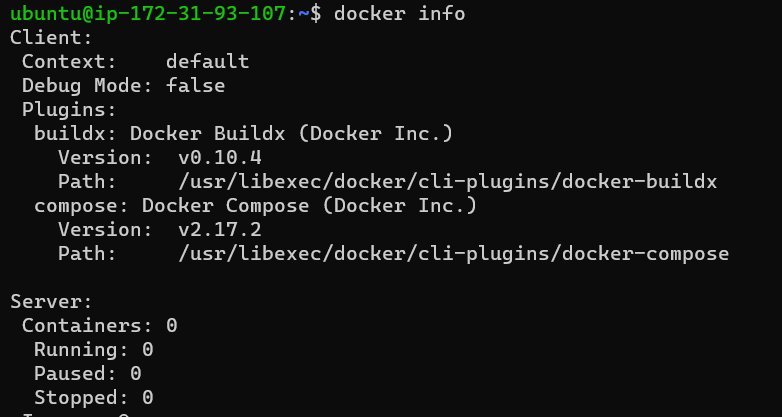

* DOCKER WORKBOOK – 1
    * RUNNING DOCKER CONTAINERS
        * Run hello-world docker container and observe the container status
        * Check the docker images and also write down the size of hello-world image
        * Run the nginx container with name as nginx1 and expose it on 8080 port on docker host
        * Explain docker container lifecycle
        * Explain what happens when you run the docker container
        * Show all the states of docker container on nginx based container
        * Explain docker architecture
* Docker installation steps
    * To install docker firstly we have to create a linux machine.
    * Required commands for installation of docker
    * `sudo apt update`
    * `curl -fsSL https://get.docker.com -o get-docker.sh` && `sh get-docker.sh`
    * Add user into docker group by using below command
    * `sudo usermod -aG docker ubuntu`
    * Exit from the linux machine
    * Reconnect it 
    * type the command `docker info`
    
    
    