Day1
----
* Docker installation steps
    * To install docker firstly we have to create a linux machine.
    * Required commands for installation of docker
    * `sudo apt update`
    * `curl -fsSL https://get.docker.com -o get-docker.sh` && `sh get-docker.sh`
    * Add user into docker group by using below command
    * `sudo usermod -aG docker ubuntu`
    * Exit from the linux machine
    * Reconnect it 
    * type the command `docker info`
    * DOCKER WORKBOOK – 1
 * RUNNING DOCKER CONTAINERS  
* Run hello-world docker container and observe the container status?
  * `docker container run -d -P --name myworld hello-world:latest`
  * `docker container run -it -P --name myworld hello-world:latest`
  * To see the container is running or not `docker container ls`
  * 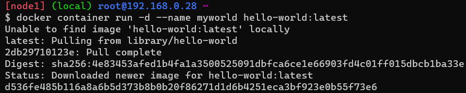
  * 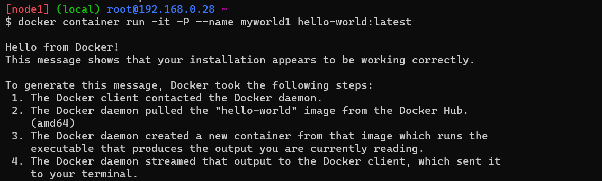
  * 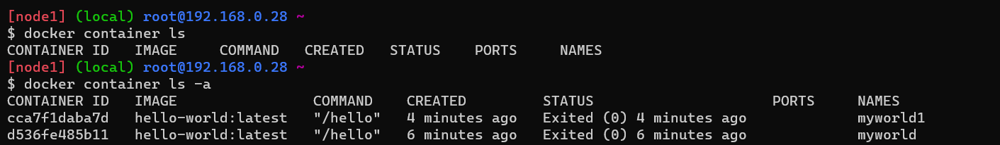
* Check the docker images and also write down the size of hello-world image?
  * 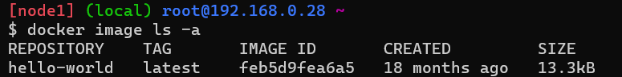
* Run the nginx container with name as nginx1 and expose it on 8080 port on docker host?
  * 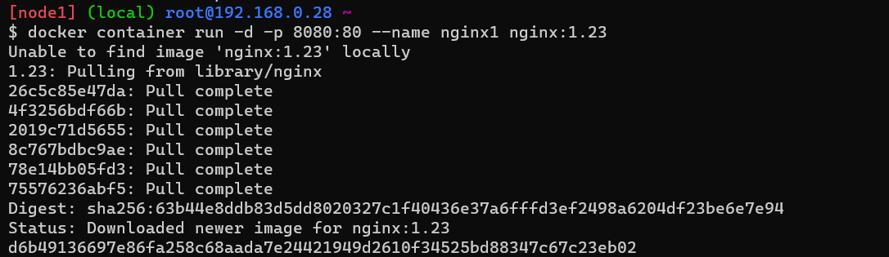
  * 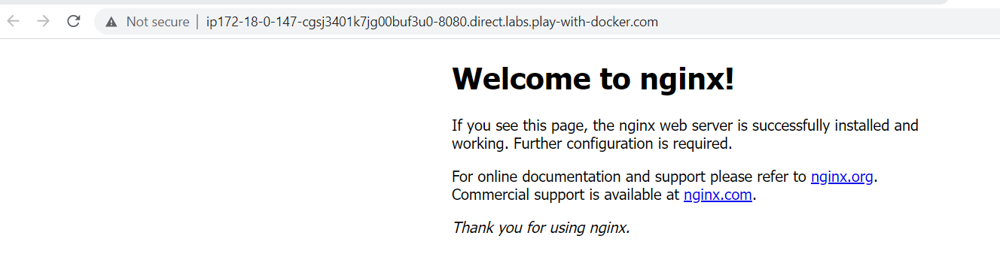
* Explain docker container lifecycle?
  * The complete lifecycle of a docker container revolves around 
  * Phases: Create phase, Running phase, Paused phase/unpause phase, start phase, stop phase, remove phase of container.
  * 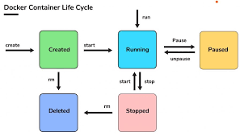
* Explain what happens when you run the docker container?
  * The docker run command creates running containers from images and can run commands inside them.When using the docker run command, a container can run a default action (if it has one), a user specified action, or a shell to be used interactively.
* Show all the states of docker container on nginx based container?
  * 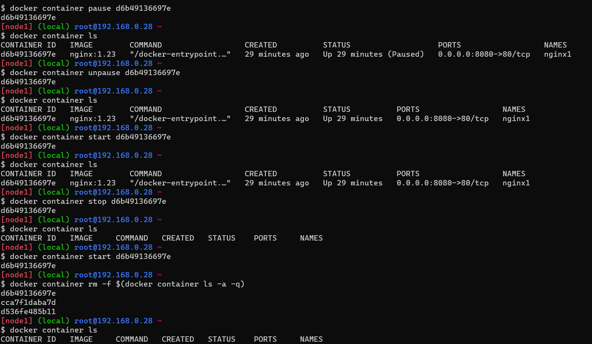
* Explain docker architecture?
  * Docker architecture. Docker uses a client-server architecture. The Docker client talks to the Docker daemon, which does the heavy lifting of building, running, and distributing your Docker containers. The Docker client and daemon can run on the same system, or you can connect a Docker client to a remote Docker daemon.
  * 

Day2
---
* Nodejs-Express application
  * commands to build and create.
  * To build image:"docker image build -t node1:16-alpine ." <name:version>
  * To Create container :"docker container run --name newjs -d -P 1a0288859300 =>"<image name/id>

 * trail-1
 * FROM node:16-alpine
 * LABEL author="Manu" organization="khaja.tec" project="nodejs"
 * RUN apk add --update npm && \
   * apk add git && \
   * git clone https://github.com/expressjs/express.git && \
   * cd express && \
   * npm install express && \
   * npm install -g express-generator@4 && \
   * express /tmp/foo && \
   * cd /tmp/foo && \
   * npm install
* WORKDIR /tmp/foo
* EXPOSE 3000
* CMD ["npm", "start"]

output :
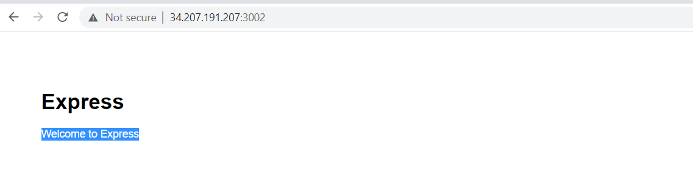

trail-2
FROM node:16-alpine
LABEL author="Manu" organization="khaja.tec" project="nodejs"
RUN apk add --update  && \
    apk add git && \
    git clone https://github.com/expressjs/express.git \
    && cd express && \
    npm install express && \
    npm install -g express-generator@4 && \
    express /tmp/foo && cd /tmp/foo && \
    npm install
WORKDIR /tmp/foo
EXPOSE 3000
CMD ["npm", "start"]

Day-3
-----
Create an alpine container in interactive mode and instal python 
------------------------------------------------------------------
  * Ans: `docker container run -it --name alpine1 -P alpine:3.16` 
  *  `apk add --update`
  *  `apk add python3` 
  *  `python3 --version`
  * 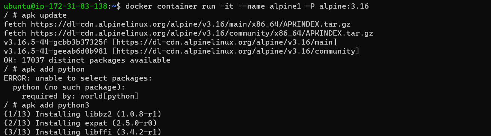
  * 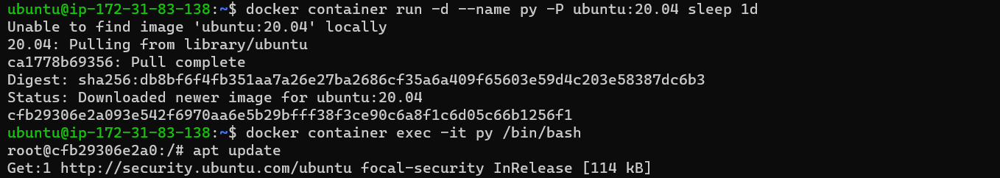
  * 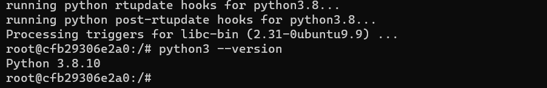
    
Create an ubuntu container with sleep 1d then login user exec.Install python
----------------------------------------------------------------------------
  * Ans:`docker container run -d --name py -P ubuntu:20.04 sleep 1d`,
  * `docker container exec -it py /bin/bash`,
  * `apt update`,`apt install python3` 
  * `python3 --version`
  * 
  * 

Create a postgress container with user panoramic and password as trekking. try logging in and show the databases (querry for thr psql)
--------------------------------------------------------------------------------------------------------------------------------------
  * Ans:`docker container run -d --name database -e POSTGRES_USER=panoramic -e POSTGRES_PASSWORD=trekking -e POSTGRES_DB=psqldata -P postgres:15`,`docker exec -it database /bin/bash`,`psql --help`,this command is used to list the database `\l`
 
  * 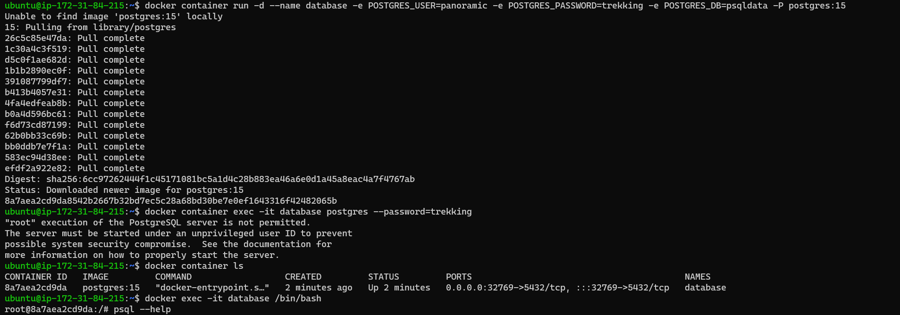
  * 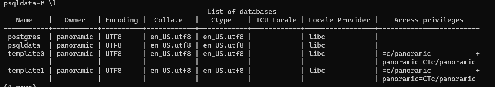
  *  * To create table `CREATE TABLE Persons (
    PersonID int,
    LastName varchar(255),
    FirstName varchar(255),
    Address varchar(255),
    City varchar(255)
);`
`Insert into Persons Values (1, 'manohar', 'gatla', 'srnagar', 'hyd'); Insert into Persons Values (2, 'raju', 'gatla', 'srnagar', 'hyd'); Insert into Persons Values (3, 'pavan', 'gatla', 'srnagar','hyd'); Insert into Persons Values (4, 'Rajreddy', 'gatla', 'srnagar', 'hyd');
SELECT * from Person;`"`
  * 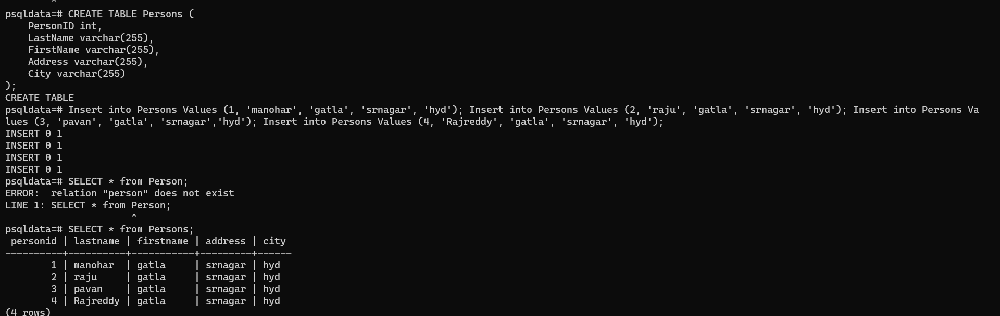
  
Try creating a docker file which runs phpinfo page, user ARG and ENV wherever appropriate 
 ----------------------------------------------------------------------------------------
  * on apache server
  * ` docker image build -t apache .`
  * ` docker container run --name php -d -P apache`
  * 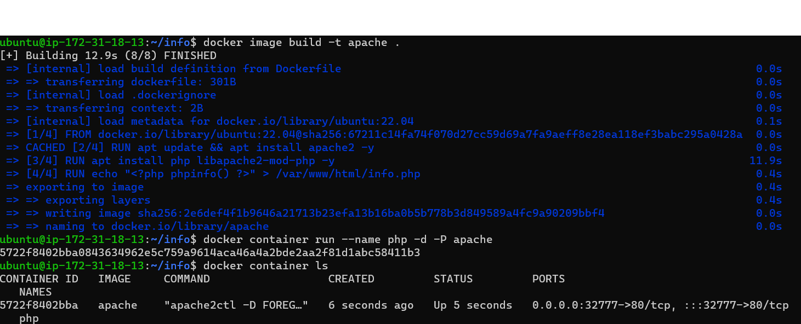
  * 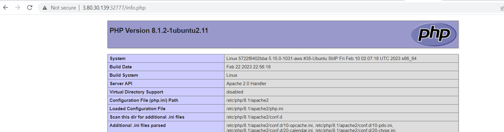
  
  * on apache server
  * ` docker image build -t nginx .`
  * 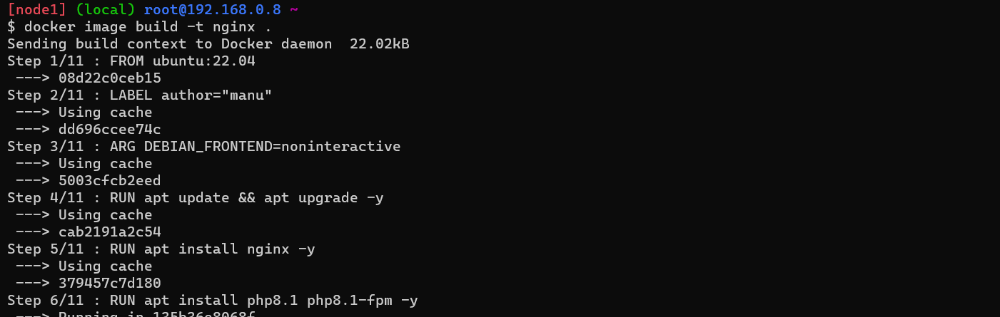
  * ` docker container run --name php -d -P nginx`
  * 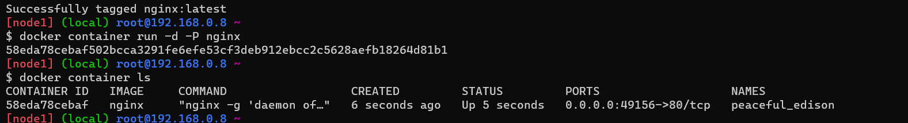
  * 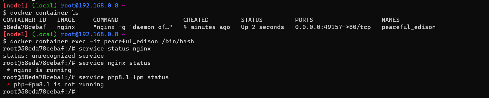
  * 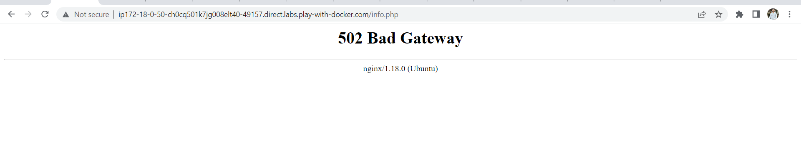
create a jenkins image by creating your own Dockerfile
---bash
FROM ubuntu:22.04
LABEL author="manu"
RUN apt update && apt install openjdk-11-jdk maven curl -y
RUN curl -fsSL https://pkg.jenkins.io/debian-stable/jenkins.io-2023.key | tee \
   /usr/share/keyrings/jenkins-keyring.asc > /dev/null
RUN echo deb [signed-by=/usr/share/keyrings/jenkins-keyring.asc] \
  https://pkg.jenkins.io/debian-stable binary/ | tee \
  /etc/apt/sources.list.d/jenkins.list > /dev/null
RUN apt-get update 
RUN apt-get install jenkins -y
EXPOSE 8080
CMD ["/usr/bin/jenkins"]``
`docker build image -t jenkins .`
* 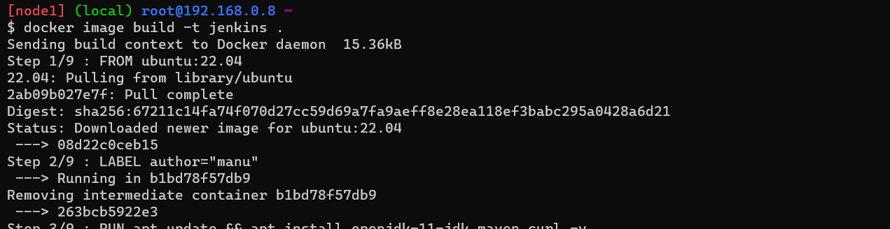
`docker container run -- name manu -d -P jenkins`
* 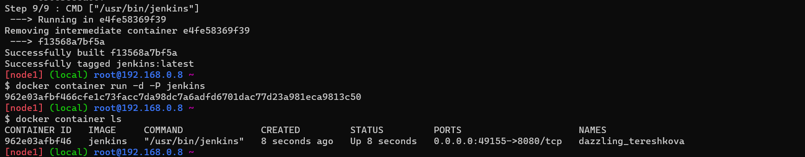
* 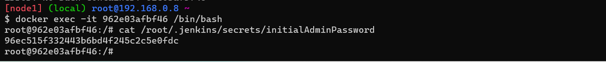
* 

Create nop commerce and my-sql server  containers and try to make them work by configuring.
-------------------------------------------------------------------------------------------
* `dockerimage build -t nop:latest`
* 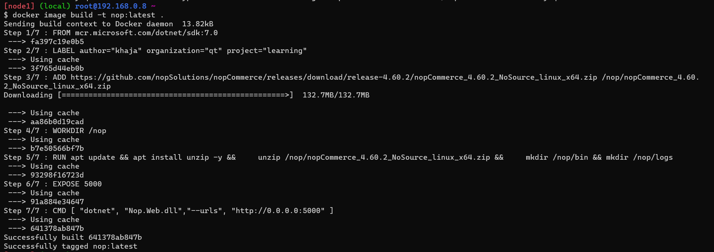
* `docker container run -d --name mysql -e MYSQL_ROOT_PASSWORD=manoharg -e MYSQL_DATABASE=test -e MYSQL_USER=manu -e MYSQL_PASSWORD=gatla --network nopnetwork -v mysql:/var/lib/mysql mysql:5.6`
* 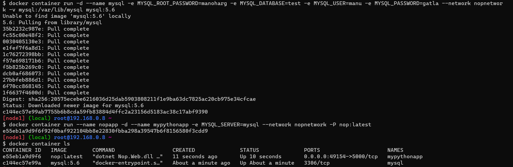
* 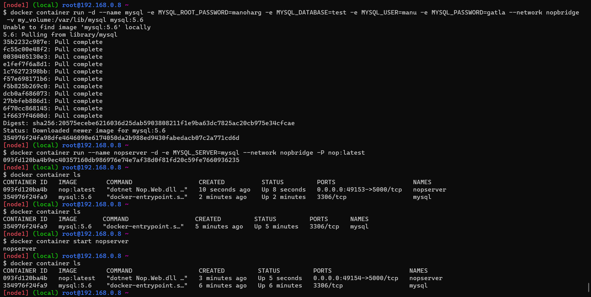
* `docker container run --name nopapp -d -e MYSQL_SERVER=mysql --network nopnetwork -P nop:latest`
* 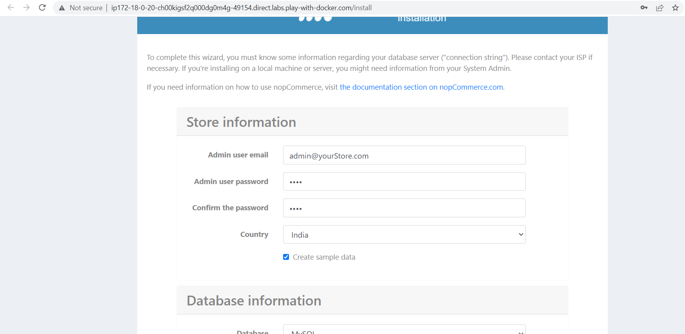
* 

    