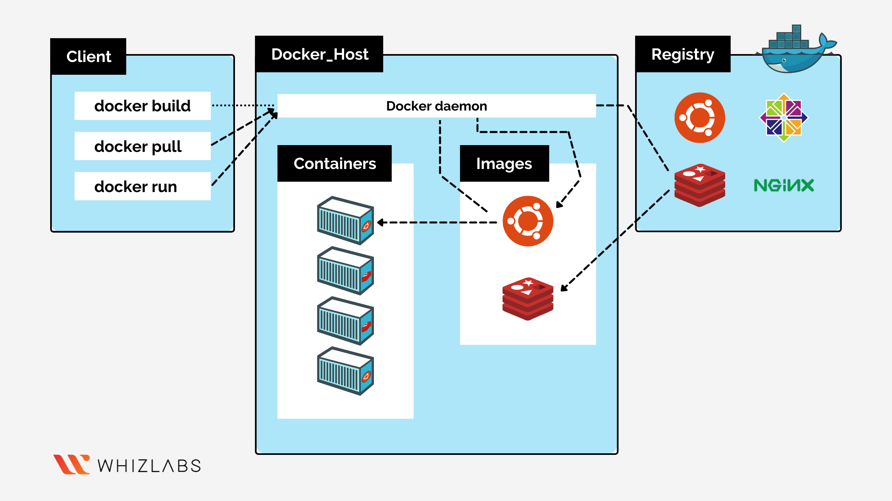

* Docker installation steps
    * To install docker firstly we have to create a linux machine.
    * Required commands for installation of docker
    * `sudo apt update`
    * `curl -fsSL https://get.docker.com -o get-docker.sh` && `sh get-docker.sh`
    * Add user into docker group by using below command
    * `sudo usermod -aG docker ubuntu`
    * Exit from the linux machine
    * Reconnect it 
    * type the command `docker info`
    * 
* DOCKER WORKBOOK – 1
 * RUNNING DOCKER CONTAINERS  
* Run hello-world docker container and observe the container status?
  * `docker container run -d -P --name myworld hello-world:latest`
  * `docker container run -it -P --name myworld hello-world:latest`
  * To see the container is running or not `docker container ls`
  * 
  * 
  * 
* Check the docker images and also write down the size of hello-world image?
  * 
* Run the nginx container with name as nginx1 and expose it on 8080 port on docker host?
  * 
  * 
* Explain docker container lifecycle?
  * The complete lifecycle of a docker container revolves around 
  * Phases: Create phase, Running phase, Paused phase/unpause phase, start phase, stop phase, remove phase of container.
  * 
* Explain what happens when you run the docker container?
  * The docker run command creates running containers from images and can run commands inside them.When using the docker run command, a container can run a default action (if it has one), a user specified action, or a shell to be used interactively.
* Show all the states of docker container on nginx based container?
  * 
* Explain docker architecture?
  * Docker architecture. Docker uses a client-server architecture. The Docker client talks to the Docker daemon, which does the heavy lifting of building, running, and distributing your Docker containers. The Docker client and daemon can run on the same system, or you can connect a Docker client to a remote Docker daemon.
  * 

    