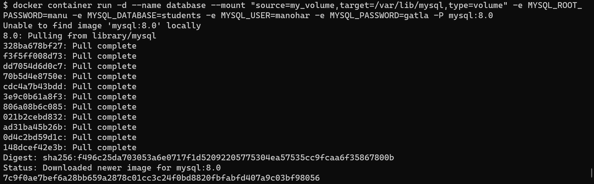
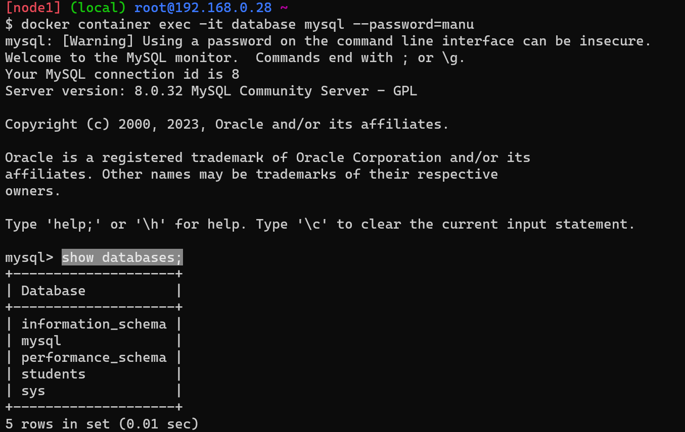
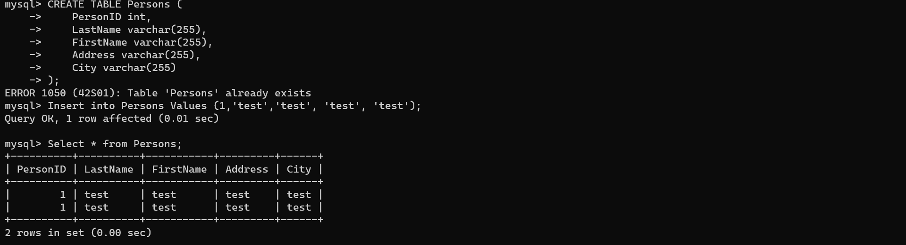

Day 2 practice
---------------
Create mysql database it is related to statefull container database 
--------------------------------------------------------------------
* command to create container with mysql database
 `$ docker container run --name mysqldb -d -e MYSQL_ROOT_PASSWORD=manugatla -e MYSQL_DATABASE=emp_list -e MYSQL_USER=gatlamanohar -e MYSQL_PASSWORD=manu -P mysql:8` 

* login into the database by using command `docker container exec -it mysqldb mysql --password=manugatla`
* To list the database use " `show databases;
use Persons;
 CREATE TABLE Persons (
    PersonID int,
    LastName varchar(255),
    FirstName varchar(255),
    Address varchar(255),
    City varchar(255)
);
Insert into Persons Values (1, 'manohar', 'gatla', 'srnagar', 'hyd'); Insert into Persons Values (2, 'raju', 'gatla', 'srnagar', 'hyd'); Insert into Persons Values (3, 'pavan', 'gatla', 'srnagar','hyd'); Insert into Persons Values (4, 'Rajreddy', 'gatla', 'srnagar', 'hyd');
SELECT * from Person;`"

-----------------------------
Attach the volume to the container it is related to stateless container database
* create container with volume attach
* `docker container run -d --name database --mount "source=my_volume,target=/var/lib/mysql,type=volume" -e MYSQL_ROOT_PASSWORD=manu -e MYSQL_DATABASE=students -e MYSQL_USER=manohar -e MYSQL_PASSWORD=gatla -P mysql:8.0`
* 
* login into the database by using command `docker container exec -it database mysql --password=manugatla`
* To list the database use " `show databases;
use Persons;
 CREATE TABLE Persons (
    PersonID int,
    LastName varchar(255),
    FirstName varchar(255),
    Address varchar(255),
    City varchar(255)
);
Insert into Persons Values (1, 'manohar', 'gatla', 'srnagar', 'hyd'); Insert into Persons Values (2, 'raju', 'gatla', 'srnagar', 'hyd'); Insert into Persons Values (3, 'pavan', 'gatla', 'srnagar','hyd'); Insert into Persons Values (4, 'Rajreddy', 'gatla', 'srnagar', 'hyd');
SELECT * from Person;`"

------------------------------
* delete the container and again create new container by attaching existing volume `docker container run -d --name mysqldb --mount "source=my_volume,target=/var/lib/mysql,type=volume" -e MYSQL_ROOT_PASSWORD=manu -e MYSQL_DATABASE=students -e MYSQL_USER=manohar -e MYSQL_PASSWORD=gatla -P mysql:8.0`
* Check the previous data by * login into the database by using command `docker container exec -it mysqldb mysql --password=manugatla`
* To list the database use  `show databases;
use Persons; SELECT * from Person;`

